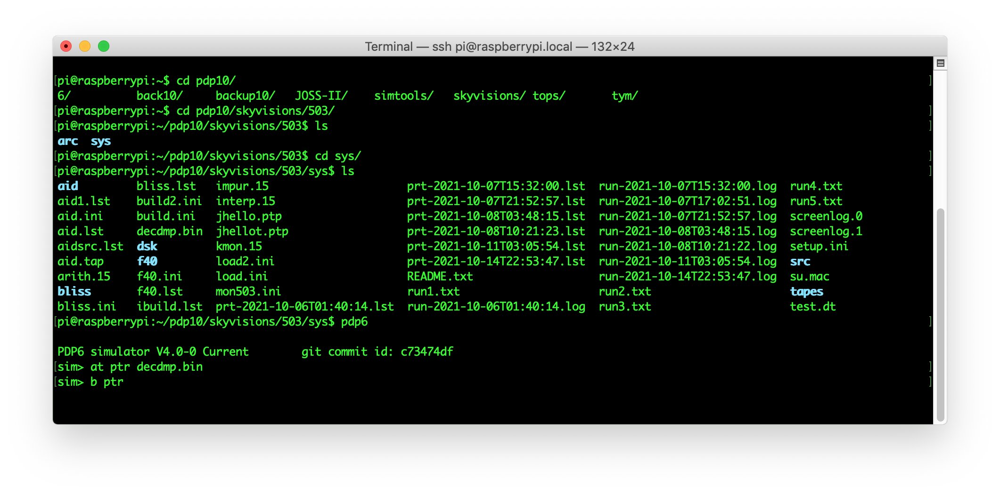

# DECDUMP for the PDP-6/10

DECDUMP was the typical Microtape/DECtape bootloader that was written by DEC for the PDP-6 and used for the first Monitor and JOSS.  This version was compiled using simh’s PDP-10 KA simulator using MACRO-10 v47 and was largely unaltered from file located (and copied and pasted) from SAILDART.  It has been tested only to the point to boot off of the simulated paper reader in simh’s PDP-6 simulator, and as of writing this README, likely works to load PDP-6 software from DECtape.

The included .bin paper tape image has been compiled for 32kW machines and has a start address of 77600 octal.

The known commands are:

| Command | Description                                                  |
| ------- | ------------------------------------------------------------ |
| *n*L    | Load  from DECtape unit *n*.  This appears to be DECtape unit 0 usually.  It can be 1 according to some of the JOSS documentation. |
| G       | Start execution of the program off of DECtape and after loading the address in the switch register.    In the case of JOSS, this would appear to be SWR address 20 octal. |

This is how far I’ve gotten:

